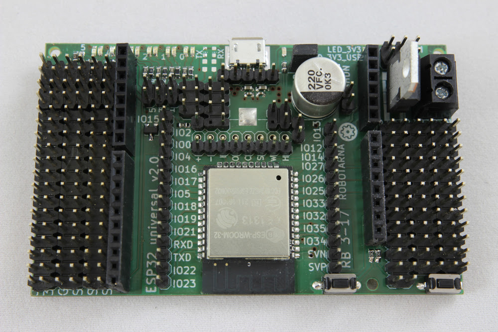

# RB3200 - ESP32 universal board

The ESP32 board you have always dreamed of by RobotikaBrno.cz!

## Features

- 4 pin headers for each of the ESP32-WROOM-32 pins
    - pin headers closest to the ESP32 module are directly exposed from the
      module
    - pin headers further from the module are protected by a serial 180R
      resistor - so you can attach e.g. a LED directly or you don't have to
      worry if you accidentally switch you grounded input to output.
    - each pin has its own 5V, 3V3 and GND pin
- Arduino Uno compatible headerincluded
- USB2Serial chip for easy button-less programming
- support for an external power supply with high-current voltage regulator
- diagnostic LEDs

## Populated board

## Manufacturing

There are pre-exported gerber files in the `gerbers` directory. This directory
is always up-to-date for every release (the master branch). There is also the
`bom.tsv` file which contains BOM with order codes for Farnell, TS, Mouser and
DigiKey. Note that the current development branch (`vX.Y`) does not guarantee
up-to-date gerber and BOM files.

As our board features many pin headers and you might not want to populate them
all, we did **not** include them in the BOM. Keep that please in mind when
ordering the components.